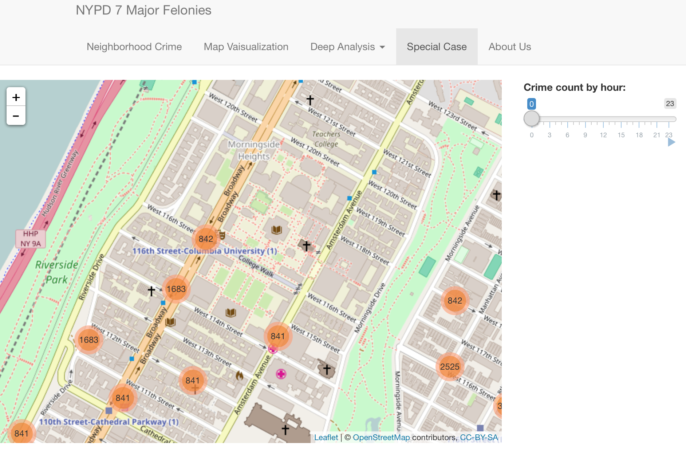

# Project: Open Data NYC - an RShiny app development project
### [Project Description](doc/project2_desc.md)

Term: Fall 2016

+ Group 11
+ Projec title: 7 Major Felony in New York City
+ Team members
	+ Chenxi Huang
	+ Hayoung Kim
	+ Zhehao Liu

All the team members have pledged that they all put effort and work for this project.
	
+ Project summary: In this project, we explore the major felony data, aiming to provide information about crime throughout New York City.

```diff
+ **After your finish your shiny app, please replace the screenshot below with one from your own app.**
```



	
**Contribution statement**: ([default](doc/a_note_on_contributions.md)) All team members contributed equally in all stages of this project. All team members approve our work presented in this GitHub repository including this contributions statement. 

Following [suggestions](http://nicercode.github.io/blog/2013-04-05-projects/) by [RICH FITZJOHN](http://nicercode.github.io/about/#Team) (@richfitz). This folder is orgarnized as follows.

```
proj/
├── lib/
├── data/
├── doc/
├── figs/
└── output/
```

Please see each subfolder for a README file.

